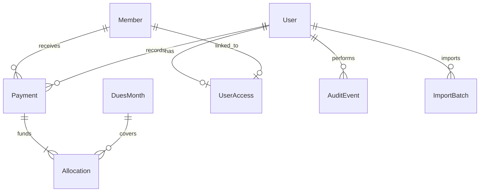

# Relational design

Member stores identity and billing dates. Payment stores an actual receipt, received amount, method, date and recorder. DuesMonth stores a unique first-of-month date and fee. Allocation connects one payment to a month; its member is derived from the payment. This separates member facts, receipt facts and monthly allocations. UserAccess links member-only accounts to exactly one member.

The receipt's member_name_snapshot is intentional historical denormalisation: renaming a member must not rewrite the identity printed on old receipts. Voiding adds actor/time/reason while preserving the original record and allocations. Active reports exclude allocations through voided payments. AuditEvent is append-only through the application. ImportBatch prevents identical CSV batches from being applied twice.

Positive amounts and unique payment-month pairs are database constraints. Equality of receipt and allocation totals and prevention of member-month over-allocation are enforced by an atomic service that locks the member; `check_finances` independently reconciles those invariants. Django migrations in ledger/migrations are the canonical schema; the same migration graph generates SQL Server or PostgreSQL DDL depending on the configured backend.
